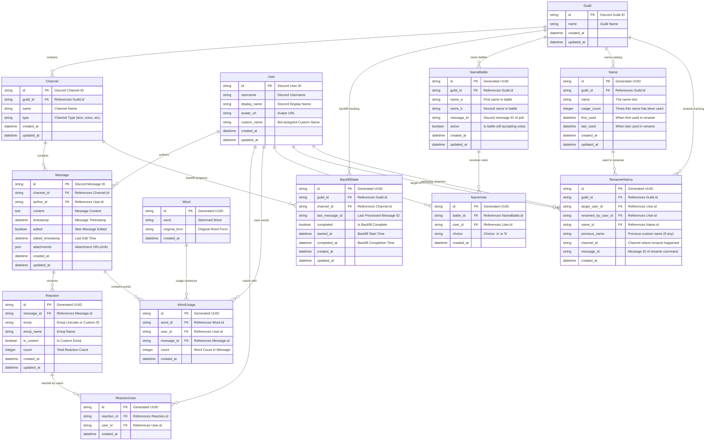

# Database Schema - Entity Relationship Diagram

## ER Diagram

## Table Details

### Guild

Represents Discord servers (guilds) where the bot operates.

### Channel

Discord channels within guilds. Tracks backfill progress per channel.

### User

Discord users with bot-assigned custom names for the rename feature.

### Message

Individual Discord messages with full content and metadata.

### Reaction

Aggregated reaction data per message. Tracks emoji type and total count.

### ReactionUser

Many-to-many relationship tracking which users reacted with which reactions.

### Word

Dictionary of stemmed words to normalize word tracking across different forms.

### WordUsage

Tracks word usage per user per message, enabling both user-specific and
server-wide analytics.

### NameBattle

Represents A vs B name voting competitions. Links to Discord message with
interactive buttons.

### NameVote

Individual user votes in name battles. Prevents duplicate voting and tracks
choice (A or B).

### Name

Catalog of all names used in the guild. Tracks popularity and usage statistics
for leaderboards.

### RenameHistory

Complete history of all rename operations. Tracks who renamed whom and when, with links back to the original rename message for Best Name leaderboards.

### BackfillState

Tracks backfill progress per guild/channel combination, enabling resumable
operations.

## Key Design Decisions

### Normalization

- Words are normalized to avoid duplicates ("running", "runs", "ran" → "run")
- Reactions are aggregated per message to optimize leaderboard queries
- Separate ReactionUser table maintains individual user reaction data
- Name battles use separate NameVote table to prevent duplicate voting
- Names are tracked separately from users to enable popularity statistics
- Complete rename history maintained for auditing and analytics

### Performance Considerations

- Composite indexes on (guild_id, channel_id) for backfill queries
- Indexes on user_id and word_id for leaderboard generation
- Message timestamp index for chronological processing
- Composite index on (battle_id, user_id) for vote uniqueness
- Index on (guild_id, active) for active battle queries
- Index on (guild_id, usage_count) for name popularity leaderboards
- Index on (guild_id, target_user_id) for rename history queries

### Scalability

- String IDs match Discord's snowflake format (up to 19 digits)
- JSON field for attachment metadata allows flexible storage
- Separate tables for reactions vs reaction users supports large servers

### Data Integrity

- Foreign key constraints ensure referential integrity
- NOT NULL constraints on critical fields
- Unique constraints on natural keys where appropriate
